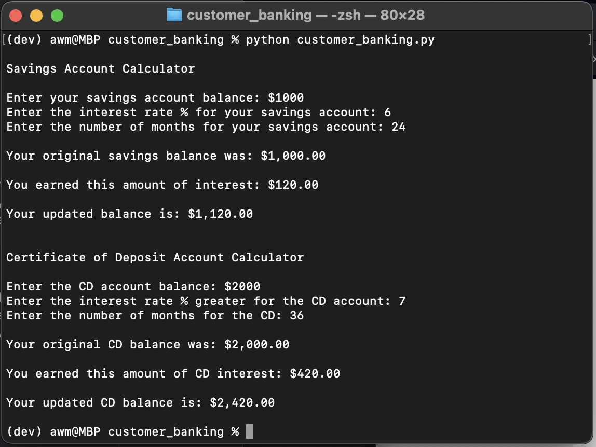

# customer_banking
Week 3 Challenge

# Functionality:
This customer banking application permits users to calculate interest earned on both savings and Certificate of Deposit (CD) accounts. By launching the customer_banking.py file, users will be able to enter the balance, the interest rate, and the number of months for each product. The application returns the updated balances and the interest earned after the specified number of months.

/Users/awm/customer_banking/Customer Banking Screenshot.png

# Design:
The primary file to launch and interact with is customer_banking.py. This application also utilizes the Account class in the Account.py file. It further uses savings_account.py and cd_account.py files for defining relevant functions.

# Plagerism Statement:
No specific code was copied but the sources below were referenced for examples and syntax. 

# Sources:

Lutz, M. (2013). Learning python: Powerful object-oriented programming. " O'Reilly Media, Inc.".

Faculty, K.-S. C. (n.d.). Introduction to python. Introduction to Python. https://textbooks.cs.ksu.edu/intro-python/01-basic-python/index.html 
